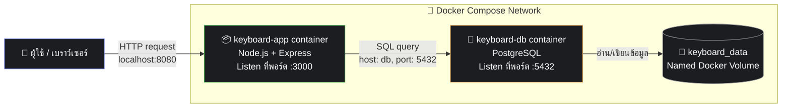

# แผนภาพระบบ (System Diagram) — Keyboard Cemetery

แผนภาพนี้แสดงความสัมพันธ์ระหว่าง container, พอร์ตเครือข่าย และ
persistent volume ในโปรเจกต์ Keyboard Cemetery

## คำอธิบาย

- **ผู้ใช้ / เบราว์เซอร์** ส่ง HTTP request ไปที่ `http://localhost:8080`
  ซึ่ง Docker จะแมปพอร์ตนี้ไปยังพอร์ต `3000` ภายใน container `keyboard-app`
- **keyboard-app** (Node.js + Express) ทำหน้าที่ให้บริการหน้าเว็บ
  (HTML/CSS/JS) และเปิด REST API (`/api/keyboards`, `/api/stats`, ...)
- **keyboard-app** เชื่อมต่อไปยัง **keyboard-db** โดยใช้ชื่อ service
  ของ Docker Compose คือ `db` ผ่านพอร์ต `5432` ซึ่งเป็นการสื่อสารระหว่าง
  container ต่อ container โดยตรง ไม่ผ่าน `localhost`
- **keyboard-db** (PostgreSQL) เก็บข้อมูลคีย์บอร์ดทั้งหมดไว้ในตาราง
  `keyboards`
- **keyboard_data** คือ named Docker volume ที่ mount ไว้ที่
  `/var/lib/postgresql/data` ภายใน container `keyboard-db`
  ซึ่งเป็นสิ่งที่ทำให้ข้อมูลยังคงอยู่แม้จะรัน `docker compose down`
  (ลบ container) ตราบใดที่ไม่ใช้ flag `-v`
